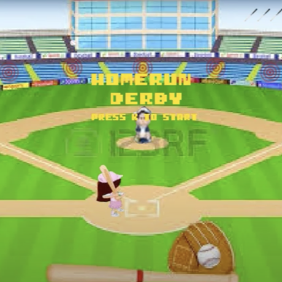

## Overview

The program "Baseball Derby" was developed by me and my brother in my high school class, AP Computer Science Principles, school year 2016-2017. Since this was the first year of Computer Science at Saint Francis School, it was apart of a group of "showcase" programs to peak the interest of the middle school division. It is a game that uses sprite sheets and moves images using a program built by the teacher. The objective of the game is to hit the targets as much as possible within three misses.  

## Contributions

Baseball Derby was implemented using Microsoft Visual Studio configured for the C++ programming language. Within one week, the project was completed. Since me and my brother decided not to split the project into roles, rather work on it whenever we had time, I did half of the program. The work that I accomplished consisted of obtaining and editing the sprites, creating the functions for the pitcher to throw at varying speeds, determining and implementing the hit-boxes, and implementing the degrees that the ball would fly based on where the batter hit. 

## The Experience

From this project, I was able to learn and experience a simplified version of making a game. A lot of communication skills were developed while brainstorming ideas and managing the progress. It also was very enlightening about teamwork as this was my first project not individually done. On top of that, I learned the fundamental concepts about sprites and the process to move them. Finally, it was a good project to assess my fundamental knowledge about C++.  
