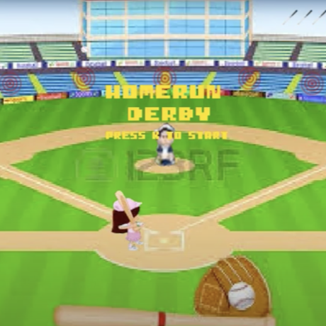

# **Task Manager App**

## Overview
A web-based task management application designed to help users organize their tasks and increase productivity. Features include task prioritization, deadlines, and notifications.

## Your Role & Responsibilities
**Lead Developer:** Designed and implemented the frontend using React and integrated it with a backend API developed in Node.js.

## Technologies Used
- **Languages:** JavaScript, HTML, CSS
- **Frameworks:** React, Express.js
- **Tools:** GitHub, Docker, AWS

## Challenges & Solutions
- **Challenge:** Ensuring real-time updates across multiple users.
- **Solution:** Implemented WebSockets for real-time communication and used Redis for message brokering.

## Results & Impact
- **Outcome:** Improved task management efficiency for users by 30%.
- **Metric:** Increased user engagement by 40% within the first three months of launch.

## Visuals & Media
- 
- 
- [Video Demo](URL_to_Video_Demo)

## Code & Documentation
- [GitHub Repository](URL_to_GitHub_Repository)
- [Project Documentation](URL_to_Project_Documentation)
- [Live Demo](URL_to_Live_Demo)

## User Experience
**User Story:** “The app has helped me keep track of my daily tasks more efficiently, and the real-time updates feature is a game-changer for my team.”

## Project Development
- **Timeline:** Completed in 6 months with major milestones including the MVP launch and user feedback iteration.
- **Team:** Collaborated with a UI/UX designer and a backend developer.