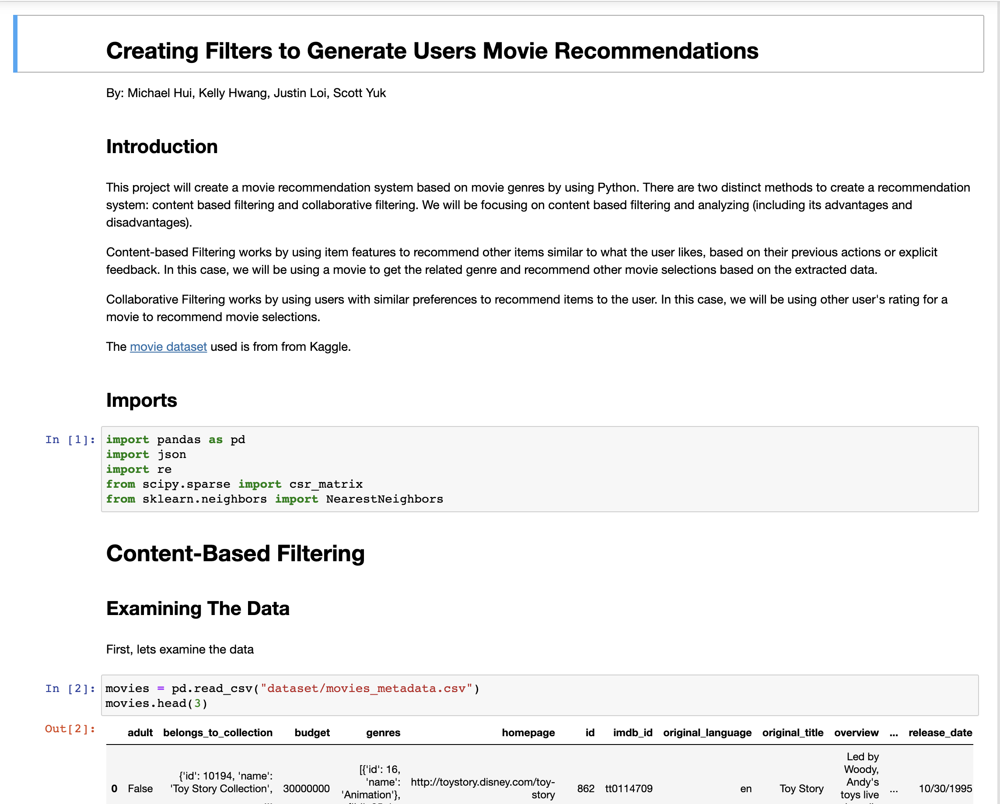

## Overview

This movie recommender system project is a group of 3 project to apply a concept of data analytics onto a relatively large-sized data. 

## Contributions

My contributions to the project are the collaborative filtering section and helping with the content-based filtering. 

## The Experience

From this project, I was able to apply the theory of finding similar movies based on a subset of movies that a user has watched. 

To see the source code, <a href="https://github.com/justin-loi/movie-recommender" target="_blank" rel="noreferrer">click here</a>
