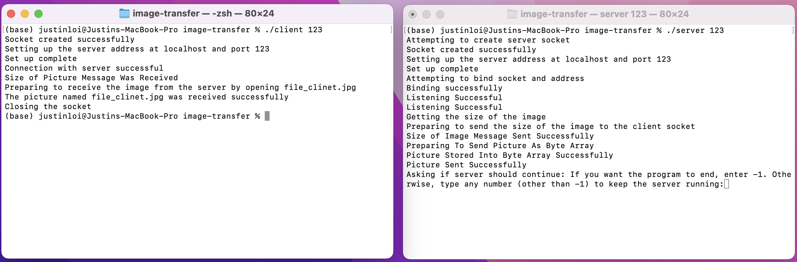

## Overview

This was an assignment for ICS: 451 to apply the knowledge of ports, TCP, and other networking topics to implement a server and client to transfer a specified photo. 

## The Experience

While this assignment is on a smaller scale than the other projects, it was valuable to apply the networking concepts and understand how data transfers. 