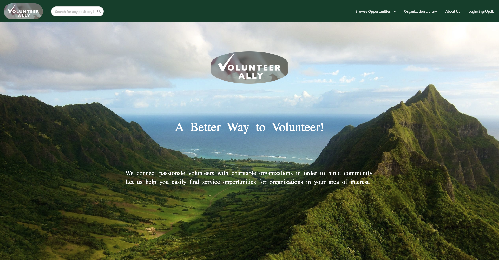
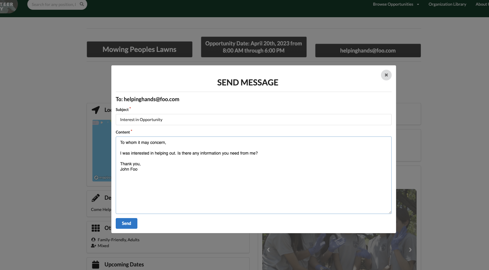
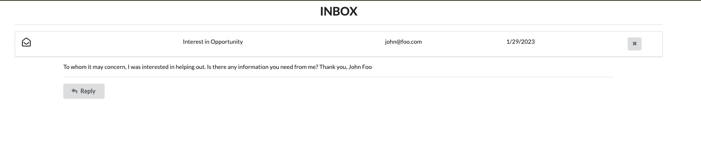

## Overview

The Web Application VolunteerAlly was a minimum viable product (MVP) to help a local non-profit organization convert from their Wordpress website after it was unable to fulfill their needs.

## Contributions

I would describe my primary role as the all-rounder contributing to both the UI/UX and back-end designs. Specifically, I helped lay out how the various collections would be pooled together to display on the respective pages. This is what led me to also design how each opportunity's info page would look. Additionally, I implement the search bar and direct message features.

## The Experience

While I am satisfied with our end product, there are some bugs hidden throughout the application and features that I was not able to complete due to its lower priority and time constraints. Needless to say, this project has been a wealth of experience and knowledge. For future projects, capitalizing on each member’s strengths while learning from both of the aforementioned mistakes is a priority. As they say, “Fool me one, shame on you; Fool me twice, shame on me.”   

To see VolunteerAlly's source code, <a href="https://github.com/justin-loi/volunteerally" target="_blank" rel="noreferrer">click here</a>

To see a deployment of Volunteerally, please be patient as it will be deployed soon 